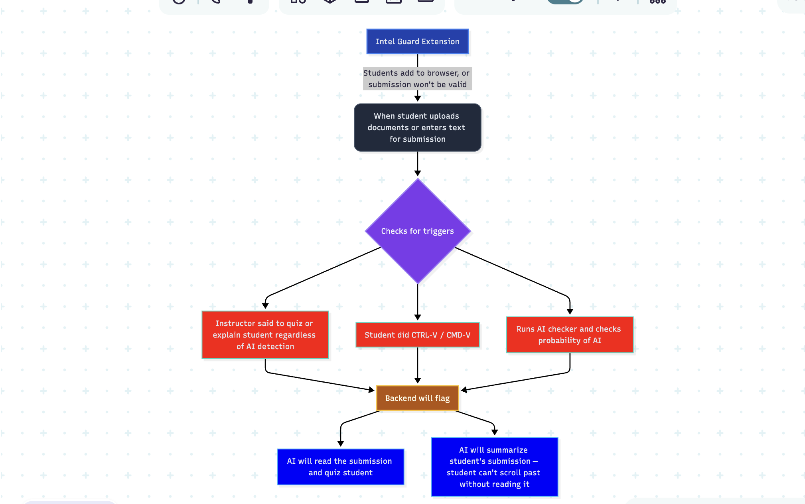

# AI Guard

**Don't block AI. Help students grow with it.**

AI Guard is an academic integrity platform that ensures students actually learn from the work they submit. Delivered as a lightweight browser extension on learning management systems (Canvas, Blackboard, Moodle), it uses behavioral heuristics to identify when a student might need a comprehension check — and then turns that moment into a learning opportunity, not a punishment.

---

## The Problem

Universities are spending millions trying to catch AI-generated submissions after the fact. Current solutions are still failing

- **AI detectors** (Turnitin, GPTZero) produce false positives, penalizing honest students and creating legal liability for institutions.
- **Honor codes** rely on trust in an era where AI tools exist, instant, and are increasingly undetectable.
- **Exam proctoring** (Respondus, Proctorio, HonorLock) only covers exams — not homework, essays, coding assignments, or lab reports where most AI usage actually happens.

The result: faculty distrust student work, students distrust detection tools, and universities are stuck in an arms race they can't win.

---

## The Solution

AI Guard takes a fundamentally different approach. We don't try to catch students — we make sure they're learning. Instead of banning AI or accusing students after the fact, AI Guard uses multiple behavioral signals to decide when a comprehension check would be valuable, and then gives the student a chance to demonstrate understanding.

### How It Works

1. **Student installs the extension** — mandated by the university, free for students, available on Chrome, Edge, and Firefox.
2. **Extension activates on LMS domains** — it only runs on authorized education platforms (Canvas, Blackboard, Moodle). It does nothing on other websites.
3. **Behavioral heuristics run in the background** — the system monitors multiple signals (paste events, completion time, writing style consistency) to build a confidence score for each submission. No single signal triggers anything on its own.
4. **If heuristics flag a submission, a comprehension check is offered** — this is not an accusation. It's a short, AI-generated quiz grounded in the assignment content. For example:
   - Submitted a Python function? Explain what the base case of the recursion does.
   - Submitted an essay paragraph about the Cold War? Identify the thesis and one supporting argument.
   - Submitted a chemistry formula derivation? Solve a slight variation of the same problem.
   - The professor can also add custom questions, which the AI evaluates based on the student's response.
5. **Strong quiz performance reduces the flag** — if a student is flagged at, say, 20% concern weight but demonstrates clear understanding on the quiz, that weight drops (e.g., to 7%). Proving comprehension is the fastest way to clear any concern. The system rewards understanding.
6. **No single report determines anything** — professors see a dashboard of trends over time, not isolated incidents. A single flag is context, not a verdict. Multiple flags across assignments with poor quiz performance might warrant a conversation — but even then, the goal is to help the student engage with the material, not to punish them.
7. **Alternative to quizzing** — if the professor prefers, students can instead read through an AI-generated explanation of their submission, reinforcing their understanding without the pressure of a quiz.

### Key Differentiator

AI Guard does not ban AI. It does not accuse students of cheating. It exists because we believe students deserve to actually understand what they submit — and that AI can be a powerful learning tool when paired with real comprehension. The platform makes sure students get the most out of their education, whether they use AI or not.

---

## Target Audience

**Primary buyer:** University administrators, provost offices, and academic integrity committees looking for scalable, institution-wide solutions that go beyond unreliable AI detection.

**Secondary stakeholders:**

- **Faculty** — get a dashboard showing comprehension trends per assignment, per student, and per course. See patterns over time, not isolated incidents. Make informed decisions about who needs support.
- **IT departments** — lightweight deployment via managed browser policies (Intune, Jamf, Google Workspace Admin). No custom infrastructure required.
- **Students** — only get quizzed when it matters, and strong performance actively clears flags. The comprehension checks double as study reinforcement — students who engage with them actually learn more.

---

## Technical Architecture

### What's Built Now

- **Python FastAPI backend** running locally with the following endpoints:
  - Upload assignment specs (the "context" that grounds all AI calls)
  - AI detection using a 7-layer heuristic prompt (content, vocabulary, grammar, formatting, chatbot artifacts, "soulless but clean" test, code-specific signals)
  - Comprehension quiz generation + answer evaluation
  - Submission summarization as an alternative to quizzing
  - Combined `/submit` endpoint that orchestrates the full flow in one call
- **LLM-agnostic** — swap between OpenAI, Anthropic, or Gemini by changing one `.env` variable
- **Cost-optimized** — dual-model routing (primary model for detection/generation, mini model for evaluation), submission caching, optional AI detection skip

### Planned (Extension + Cloud)

- **Content Script** — injected on whitelisted LMS domains. Monitors paste events on assignment submission forms and intercepts the submit action.
- **Popup UI** — shows the student their comprehension check status and history.
- **Background Service Worker** — handles communication with the AI Guard backend, manages auth tokens, and caches quiz state.
- **LMS Gating Token** — the extension injects a verification header/token that the LMS (configured by the university) requires for submission access. No extension = no submission.
- **LMS Integration Layer** — connects via LTI 1.3 and Canvas/Blackboard REST APIs for assignment metadata, course info, and grade passback.
- **Analytics Pipeline** — aggregates anonymized comprehension data for instructor and admin dashboards.
- **Auth Service** — university SSO integration (SAML 2.0, OAuth 2.0) so students log in with existing campus credentials.

### Behavioral Heuristics (Planned)

AI Guard doesn't quiz every student on every submission — that would be exhausting and counterproductive. Instead, the system runs behavioral heuristics in the background and only triggers a comprehension check when the combination of signals suggests it would be valuable. Think of it as a smart filter: most submissions pass through without interruption, and the ones that get flagged receive a learning opportunity, not an accusation.

Each heuristic contributes a weighted confidence score. No single heuristic can trigger a quiz on its own. And if a student is flagged but demonstrates strong comprehension on the quiz, the flag weight is actively reduced — the system learns that this student understands their work, and adjusts accordingly.

#### 1. Time-Based Analysis

For an assignment that should take two weeks, submitting a polished solution minutes after opening it is worth a second look. AI Guard tracks the time between when a student first accesses an assignment and when they submit it.

- **Professor sets an estimated completion time** — when creating an assignment, the instructor provides a reasonable time estimate (e.g., "this should take 8–12 hours of work over two weeks").
- **Extension records timestamps** — the browser extension logs when the student first opens the assignment page and when they submit.
- **Heuristic comparison** — if a student's completion time falls significantly outside the expected range (e.g., a 12-hour assignment completed in 45 minutes), it adds weight to the confidence score. The system uses a configurable tolerance range to account for naturally faster or slower students.

This doesn't prove anything on its own — a fast student might genuinely be that fast. It's one data point among many.

#### 2. Writing Style Fingerprinting

Every student writes differently. Over time, AI Guard builds a per-student writing profile — a fingerprint of their natural style — and notices when a submission deviates significantly from it.

**How it works:**

- **Professor uploads previous assignments** — for each student, earlier submissions (essays, code, lab reports) are fed into the system to establish a baseline.
- **AI analyzes and stores the student's writing style** — the system identifies patterns like:
  - **Prose:** Tone (casual vs. formal), vocabulary preferences, use of emphasis words (e.g., a student who frequently writes "ridiculously large" or "insanely complex"), reliance on examples, sentence structure habits, paragraph length tendencies.
  - **Code:** Variable naming conventions (e.g., `index` vs. `idx` vs. `i`), preference for multi-line vs. single-line expressions, comment style, indentation habits, control flow patterns, function decomposition style.
- **Style profile is stored per student** — each student's fingerprint lives in a cloud-based profile, linked to their identity across courses and semesters.
- **Future submissions are compared against the baseline** — after 3–4 assignments, the system has enough data to detect meaningful deviations. For example:
  - A student who always writes casually suddenly submits a formal, polished essay with no contractions.
  - A student who consistently names loop variables `index` suddenly uses `idx` and `i` throughout.
  - A student who writes verbose, multi-line code suddenly submits a compact, one-liner-heavy solution.

Students naturally grow and evolve — that's the whole point of education. The system accounts for gradual shifts. What it looks for is sudden, dramatic changes across multiple style dimensions on a single assignment, which might indicate the student could benefit from a comprehension check.

#### The Confidence Score System

Here's how the pieces fit together:

- Each heuristic contributes a **weighted score** to the overall confidence level for a submission.
- When the combined score crosses a threshold, the student receives a comprehension check (quiz or summary walkthrough).
- **Strong quiz performance reduces the flag weight** — for example, a submission flagged at 20% concern that the student aces on the quiz might drop to 7%. The system actively rewards demonstrated understanding.
- **Professors see trends, not isolated incidents** — the instructor dashboard shows patterns over time. A single flag on one assignment is context, not a conclusion. It takes consistent patterns across multiple submissions to build a meaningful signal.
- **The professor decides what to do** — AI Guard provides information and insight. It never makes the final call. If a professor sees that a student has been flagged three times but passed every comprehension check with flying colors, that tells a very different story than a student flagged three times who struggles on every quiz.

The entire system is designed around one principle: **students deserve to actually understand what they submit, and the best way to ensure that is to check in when it matters — not to surveil everyone all the time.**

#### What If the Student Uses LLMs to Answer the Quiz?

A fair question — if a student gets flagged and receives a comprehension check, what stops them from pasting the questions into ChatGPT and copying back the answers?

**Short answer:** we don't try to lock students out of their computer. That's the proctoring approach (Respondus, Proctorio), and it's invasive, brittle, and adversarial — the opposite of what AI Guard stands for. Instead, we make it impractical and, more importantly, observable.

**How we handle it:**

- **Tight time window** — the quiz is 3 questions about work the student supposedly wrote. If they actually understand it, answering should take a minute or two. The extension enforces a short, fair time limit — enough for someone who knows their work, but not enough to comfortably copy each question into an LLM, read the response, and paste it back three times.

- **Paste detection on quiz answers** — the extension monitors paste events directly on the quiz answer fields. If a student pastes text into their answer instead of typing it, that's logged as a signal. A student who genuinely understands their own work doesn't need to paste answers to questions about it. This alone isn't damning — maybe they're just a fast typist who composed in another field — but combined with other signals, it tells a story.

- **Tab-switch and focus detection** — the extension listens for `visibilitychange` and `blur` events on the quiz page. If the student switches to another tab, opens a new window, or leaves the quiz page during those 3 questions, the extension logs it. It doesn't block the behavior — it records it. A student who stays focused and answers quickly looks very different from one who alt-tabs 6 times during a 90-second quiz.

- **All quiz-time behavior feeds into the confidence score** — this is the key insight. We don't treat any single action as proof of cheating. We treat it as another behavioral signal. A student who was flagged, stayed focused on the quiz, typed their answers, and got them right? Their flag weight drops significantly — they clearly understand the material. A student who was flagged, switched tabs 5 times, pasted in their answers, and took 4 minutes on a simple question? That behavior itself adds weight to the flag, even if they eventually got the answers right. The professor sees all of it.

- **The math doesn't work in the student's favor** — even if a student manages to cheat on the quiz within the time limit, the combination of tab-switching + paste events + suspicious timing + whatever heuristics flagged them in the first place builds a pattern that the professor can see clearly on the dashboard. Cheating on the quiz doesn't clear the flag — it just adds more context.

The result: students who actually understand their work breeze through the quiz in 60 seconds, type their answers, their flag drops, and they move on. Students who don't understand their work either struggle honestly (which is valuable feedback for the professor) or exhibit suspicious behavior trying to cheat the quiz (which is equally valuable information). Either way, the professor gets a clearer picture.

#### More Heuristics to Come

Time analysis, writing style fingerprinting, and quiz-time behavioral monitoring are just the beginning. We are actively researching additional behavioral patterns and signals to build a robust, multi-signal detection system where no single heuristic is a verdict, but the combination provides professors with the context they need to support their students.

---

## Business Model

AI Guard follows the standard B2B SaaS model used across education technologies like Turnitin, Respondus, Proctorio, HonorLock, Gradescope and many more. The university pays for it, not the students.

## Roadmap

### Phase 1 — Local Backend (current)
- Python FastAPI backend with AI detection, quiz, and summary endpoints
- LLM-agnostic architecture (OpenAI / Anthropic / Gemini)
- Cost optimizations: dual-model routing, submission caching, optional detection skip

### Phase 2 — Browser Extension
- Chrome extension with paste detection on Canvas
- Submit button interception + comprehension check overlay
- Communication with backend API
- Time-based analysis: track assignment open → submit timestamps

### Phase 3 — Behavioral Heuristics
- Writing style fingerprinting: build per-student style profiles from historical submissions
- Code style analysis: variable naming, formatting habits, decomposition patterns
- Cross-assignment deviation detection (requires 3–4 submissions per student)
- Cloud-based student profile storage

### Phase 4 — Cloud + LMS Integration
- Deploy backend to cloud (AWS / GCP)
- LTI 1.3 integration with Canvas, Blackboard, Moodle
- Instructor dashboard with comprehension trends and heuristic flags
- University SSO (SAML 2.0, OAuth 2.0)

## Tech Stack

| Layer | Technology |
|-------|-----------|
| Backend API | Python, FastAPI |
| AI / Comprehension Engine | OpenAI / Anthropic / Gemini (provider-agnostic) |
| Storage (current) | JSON files on disk |
| Storage (planned) | PostgreSQL + Redis |
| Extension (planned) | JavaScript/TypeScript, Chrome Extensions Manifest V3 |
| Frontend Dashboard (planned) | React, TypeScript, Tailwind CSS |
| Auth (planned) | SAML 2.0, OAuth 2.0, JWT |
| Infrastructure (planned) | AWS / GCP, Docker |
| LMS Integration (planned) | LTI 1.3, Canvas REST API, Blackboard REST API |

---

